# AI Chat Watch (AICW)

AI Chat Watch (aka AICW) is the tool for GEO (Generative Engine Optimization) marketers to track mentions of brands/products/websites by AI like ChatGPT. See who is mentioned first and how often, by which AI, how mentions change over time. Instantly see sources for citations. Track trends over time. See how your brand is positioned compared to competitors in AI search results. AICW is **free open-source and runs on your computer, you own all your data**. Explore sample reports: https://aichatwatch.com/demo/reports/

*ELI5 (Explain like I'm 5 years old)?*: *AI Chat Watch is like a notebook that keeps track of which toys or pizza places the robot talks about!*

---

## 📑 Table of Contents

- [Sample Reports](#sample-reports)
- [Features](#features)
- [🚀 Quick Start](#-quick-start)
- [🎬 AICW in Action](#-aicw-in-action)
- [📊 All Sample Reports](#-all-sample-reports)
- [💾 Data Storage](#-data-storage)
- [🛠️ Development & Contributing](#️-development--contributing)
- [📊 Pipeline Architecture](#-pipeline-architecture) ⭐ _NEW_
- [🤝 Support](#-support)
- [📄 License](#-license)
- [🔔 Schedule a Report](#-schedule-a-report)
- [Contacts](#contacts)

---

## Features:

- ✅ **Multi-Model Querying** - ChatGPT, Claude, Perplexity, Gemini and many others
- ✅ **Influence(Voice) Scoring** - Weighted by AI model usage data
- ✅ **Brands Extraction** - Identify products, companies, people, places, events mentioned.
- ✅ **Beautiful Reports** - Interactive HTML with tables, charts, graphs and drill-downs and advanced filtering.
- ✅ **Historical Trends** - Track rising/falling positions and mentions over time
- ✅ **Export to CSV and JSON** - Export any data to CSV or access original data in JSON format.
- ✅ **Full Source Code** - Audit algorithms, verify calculations, contribute

## 🚀 Quick Start

# Try it without installation

Run `Terminal` app and paste this command:

```bash
npx @aichatwatch/aicw
```

### Installation (2 minutes)

Run `Terminal` app and paste this command:

```bash
npm install -g @aichatwatch/aicw
```

Then run by typing:

```bash
aicw
``` 

And press Enter to start AICW (AI Chat Watch) and follow the instructions.

**Requirements:**

- Node.js 18+ ([Download](https://nodejs.org/))
- API key from [OpenRouter](https://openrouter.ai/keys) (recommended, free tier available) or [OpenAI](https://platform.openai.com/api-keys) or any other AI model provider.

**Cost:** The software is free. You only pay for AI usage through OpenRouter/OpenAI/Perplexity as you consume it:
- Typical cost: **$0.01-$0.10 per answer** + **$0.01-$0.05 per question** for enrichment/analysis
- **Example:** 5 questions × 3 AI models = 15 answers + enrichment ≈ **$0.30-$1.75 total** (depending on which models you select)
- You control costs by choosing which models to query (free, mid-tier, or premium) and how many questions to ask.

## 🎬 AICW in Action

### Terminal Interface

<p align="center">
  
</p>

**Interactive CLI menu** - Create projects, run pipelines, generate reports, all from your terminal.

<p align="center">
  
</p>

**View Top Influencers, Filter by AI Model, Filter by Trend** - Explore live reports

<p align="center">
  <a href="https://aichatwatch.com/demo/reports/" target="_blank">
    
  </a>
</p>

<p align="center">
  <a href="https://aichatwatch.com/demo/reports/" target="_blank">
    
  </a>
</p>

---

## 📊 All Sample Reports

**https://aichatwatch.com/demo/reports/**

Sample reports generated by AICW:

- **Best Cities for Nomads** - Travel & lifestyle tracking
- **Top AI Tools** - Technology & platforms
- **Y Combinator** - Analyzing specific topic (Y Combinator)
- **High Blood Pressure & Hypertension** - Healthcare & treatment recommendations from AI models
- **Best Lawyer for a Startup** - Legal services & professionals
- and other sample reports

**[→ Explore all at https://aichatwatch.com/demo/reports/](https://aichatwatch.com/demo/reports/)**

## 💾 Data Storage

AICW stores all data locally in platform-specific directories:

- **macOS:** `~/Library/Application Support/aicw/default-user/data/`
- **Windows:** `%APPDATA%\aicw\default-user\data\`
- **Linux:** `~/.config/aicw/default-user/data/`


**Data Privacy:** All data stays on your machine. AICW doesn't send anything to third parties (except API calls to AI providers you configure).

---

## 🛠️ Development & Contributing

AICW is built with TypeScript and designed for extensibility.

### Local Development

```bash
git clone https://github.com/aichatwatch/aicw.git
cd aicw
npm install
npm run build
npm link

# Now 'aicw' command uses your local version
aicw
```

We welcome contributions! See [CONTRIBUTING.md](CONTRIBUTING.md) for guidelines.

---

## 📊 Pipeline Architecture

_Last updated: 2025-10-14_

AICW uses a multi-stage pipeline to transform AI responses into actionable insights. Here's the complete build pipeline flow:

```mermaid
flowchart TD
    Start([Start]) --> Setup{Select Pipeline}

    Setup -->|New Project| NewProject[Project: Create New]
    Setup -->|Build| PrepFolders[Prepare Folders]
    Setup -->|Rebuild| PrepFolders

    NewProject --> PrepFolders

    subgraph Setup["Setup Phase"]
        PrepFolders[Prepare Question Folders]
        CleanupCompiled[Cleanup: Remove Old Data]
        CleanupOrphaned[Cleanup: Remove Orphaned Questions]
        DataFileCreate[Create Data Files]
    end

    PrepFolders --> CleanupCompiled
    CleanupCompiled --> CleanupOrphaned
    CleanupOrphaned --> DataFileCreate

    DataFileCreate --> CheckPipeline{Which Pipeline?}
    CheckPipeline -->|Full Build| FetchAnswers
    CheckPipeline -->|Rebuild| ExtractPrompt

    subgraph DataCollection["Data Collection"]
        FetchAnswers[Fetch Answers from AI Models]
    end

    FetchAnswers --> ExtractPrompt

    subgraph EntityExtraction["🔍 Entity Extraction"]
        ExtractPrompt[Prepare Entity Extraction Prompts]
        ExtractEntities[Extract Entities using AI]
        ExtractLinks[Extract Links from Answers]
    end

    ExtractPrompt --> ExtractEntities
    ExtractEntities --> ExtractLinks

    subgraph LinkProcessing["🔗 Link Processing"]
        GetLinkType[Classify Links by Pattern]
        GetLinkTypeAI[AI Classification for Unclassified Links]
        GenLinkTypes[Generate LinkTypes Array]
        GenLinkDomains[Generate LinkDomains Array]
    end

    ExtractLinks --> GetLinkType
    GetLinkType --> GetLinkTypeAI
    GetLinkTypeAI --> GenLinkTypes
    GenLinkTypes --> GenLinkDomains

    subgraph Enrichment["Enrichment & Calculations"]
        CalcMentions[Calculate Mentions]
        CalcAppearance[Calculate Appearance Order]
        CalcInfluence[Calculate Influence Scores]
        CalcTrends[Calculate Historical Trends]

        LinkTypesMentions[Calculate LinkTypes Mentions]
        LinkTypesAppearance[Calculate LinkTypes Appearance]
        LinkTypesInfluence[Calculate LinkTypes Influence]
        LinkTypesTrends[Calculate LinkTypes Trends]

        GenLinks[Generate Entity URLs using AI]
        GenSimilar[Generate Similar Terms using AI]
        GenSummary[Generate AI Summary]
    end

    GenLinkDomains --> CalcMentions
    CalcMentions --> CalcAppearance
    CalcAppearance --> CalcInfluence
    CalcInfluence --> CalcTrends

    CalcTrends --> LinkTypesMentions
    LinkTypesMentions --> LinkTypesAppearance
    LinkTypesAppearance --> LinkTypesInfluence
    LinkTypesInfluence --> LinkTypesTrends

    LinkTypesTrends --> GenLinks
    GenLinks --> GenSimilar
    GenSimilar --> GenSummary

    subgraph ReportGeneration["📊 Report Generation"]
        CleanupReports[Cleanup: Remove Old Reports]
        GenAnswersFile[Generate Answers File]
        GenReport[Generate HTML Reports]
        GenNavigation[Generate Project Navigation]
        ShowSuccess[Show Success Message]
    end

    GenSummary --> CleanupReports
    CleanupReports --> GenAnswersFile
    GenAnswersFile --> GenReport
    GenReport --> GenNavigation
    GenNavigation --> ShowSuccess

    ShowSuccess --> End([End])

    style Start fill:#90EE90
    style End fill:#90EE90
    style Setup fill:#87CEEB
    style DataCollection fill:#98FB98
    style EntityExtraction fill:#FFD700
    style LinkProcessing fill:#FFA500
    style Enrichment fill:#DDA0DD
    style ReportGeneration fill:#87CEFA
    style NewProject fill:#FFB6C1
```



### Pipeline Types

1. **pipeline-project-new**: Create a new project with questions → Auto-runs pipeline-project-build
2. **pipeline-project-build**: Complete pipeline - Fetch fresh AI answers, extract entities, enrich data, generate reports
3. **pipeline-project-rebuild**: Rebuild from existing answers - Skip fetch step, reprocess everything else
4. **pipeline-project-rebuild-report-only**: Generate reports only - Use existing enriched data, regenerate HTML

### Key Stages

- **Setup Phase** (cyan): Prepares project structure and cleans old data
- **Data Collection** (green): Queries AI models for answers (skipped in rebuild)
- **Entity Extraction** (yellow): Identifies companies, products, people, places, events
- **Link Processing** (orange): Classifies URLs and domains by type
- **Enrichment** (purple): Calculates metrics, trends, and generates AI insights
- **Report Generation** (blue): Creates interactive HTML reports with visualizations

---

## 🤝 Support

### Create an Issue if you have any questions or problems
- [Issues](https://github.com/aichatwatch/aicw/issues)

---

## 📄 License

**Elastic License v2 (ELv2)** - See [LICENSE.md](LICENSE.md)

**In plain English:**
- ✅ **Run on your computer for any purpose** - Personal use, commercial use, business use - completely **free** with no limits. 
- ✅ Use, modify, and distribute freely
- ✅ View and audit all source code
- ✅ **You control all costs** - Only pay for AI API usage through OpenRouter/OpenAI/Perplexity as you consume it
- ❌ Cannot offer AICW as a hosted service to others

# 🔔 Schedule a Report

To create a report for the current date, run "project-build" pipeline and it will run full pipeline for the current date. The new report will be created and will indicate trend (growing, declining, stable) for every item where possible using newly captured data and data from previous reports.

If want to schedule capturing new data and generating a report with trends to be sent weekly or monthly to your inbox automatically, please visit https://aichatwatch.com/cloud for more information.

# Contacts

- [Website](https://aichatwatch.com)
- Email: `aichatwatch@gmail.com`
